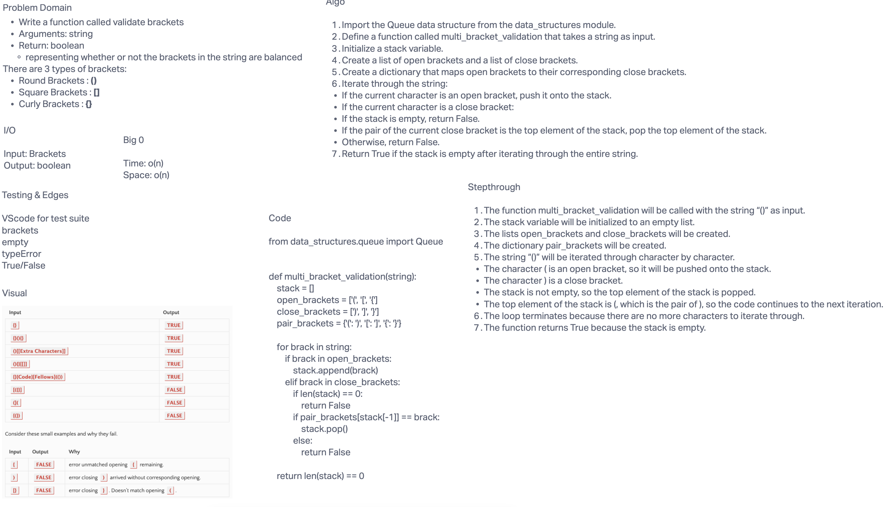

# Day 15 Code Challenge

<!--  -->

[Code For Today](https://github.com/iAmAndrewCarroll/data-structures-and-algorithms/pull/25)

 - [x] Top-level README “Table of Contents” is updated
 - [x] README for this challenge is complete
       - [x] Summary, Description, Approach & Efficiency, Solution
       - [x] Picture of whiteboard
       - [?] Link to code
 - [x] Feature tasks for this challenge are completed
 - [?] Unit tests written and passing
       - [?] “Happy Path” - Expected outcome
       - [?] Expected failure
       - [?] Edge Case (if applicable/obvious)

# Collaboration with Raven, chatGPT, Bard, Dan Q, Sarah G, Logan, Jared, Anthony, Slava

# Collaboration with Roger Huba's dope starter code and lecture

# Big shoutouts to ChatGPT for being the real MVP, Bard was there to but was overly verbose, Google, GitHub Repos
