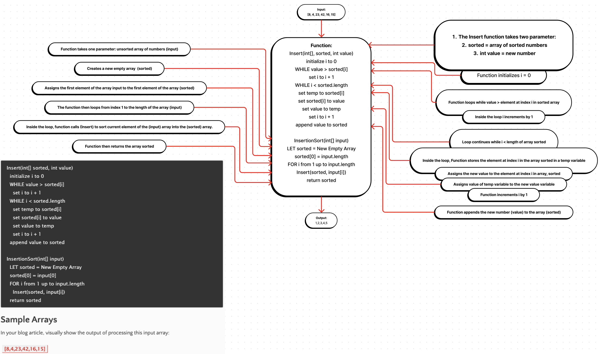

* Blog Article

**The Insertion Sort Algorithm: A Step-by-Step Guide**

The insertion sort algorithm is a simple sorting algorithm that works by repeatedly inserting a new element into a sorted subarray. The algorithm starts by creating an empty array called `sorted`. The first element of the input array is then added to the `sorted` array. The algorithm then loops through the remaining elements of the input array. For each element, the algorithm compares the element to the elements in the `sorted` array. If the element is smaller than any of the elements in the `sorted` array, the elements in the `sorted` array are shifted to the right to make room for the new element. The new element is then inserted into the `sorted` array. The algorithm continues looping until all of the elements in the input array have been inserted into the `sorted` array.

Let's take a look at how the insertion sort algorithm would work on the array `[8, 4, 3, 9, 1, 7]`.

**Step 1: Initialize the `sorted` array.**

The `sorted` array is initialized to an empty array.

```
sorted = []
```

**Step 2: Add the first element of the input array to the `sorted` array.**

The first element of the input array is `8`. We add `8` to the `sorted` array.

```
sorted = [8]
```

**Step 3: Loop through the remaining elements of the input array.**

The remaining elements of the input array are `4, 3, 9, 1, 7`.

**Step 4: Compare the current element to the elements in the `sorted` array.**

We start by comparing the first element of the remaining elements, `4`, to the element in the `sorted` array, `8`. Since `4` is smaller than `8`, we need to shift the elements in the `sorted` array to the right to make room for `4`.

```
sorted = [4, 8]
```

**Step 5: Insert the current element into the `sorted` array.**

We now insert `4` into the `sorted` array at index 0.

```
sorted = [4, 8]
```

**Step 6: Repeat steps 4 and 5 for the remaining elements of the input array.**

We now repeat steps 4 and 5 for the remaining elements of the input array, `3, 9, 1, 7`.

**Step 7: The `sorted` array is now sorted.**

After repeating steps 4 and 5 for all of the elements in the input array, the `sorted` array will be sorted.

```
sorted = [1, 3, 4, 8, 9, 7]
```

As you can see, the insertion sort algorithm is a simple and efficient way to sort an array. It is not the fastest sorting algorithm, but it is easy to understand and implement.

