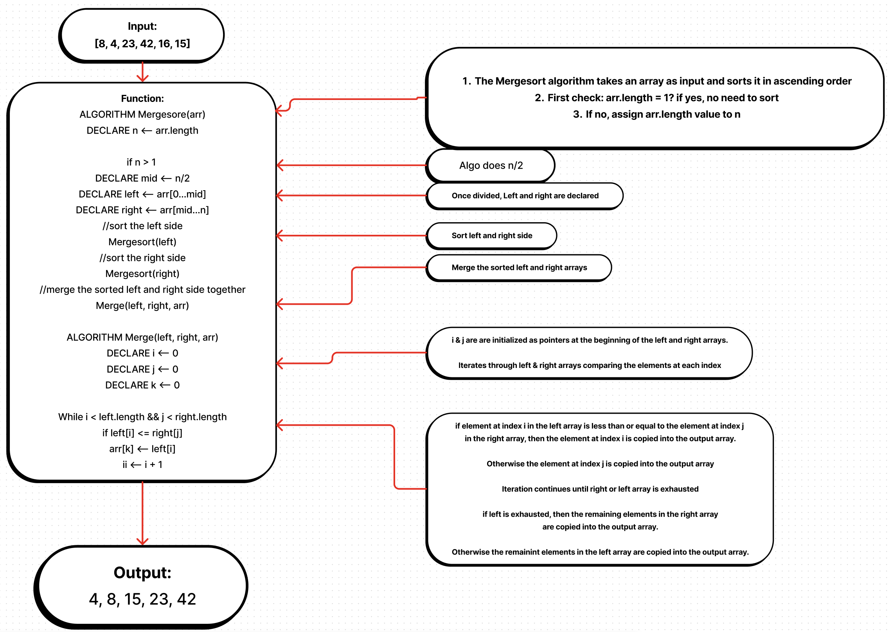

Mergesort: A Divide and Conquer Algorithm

Mergesort is a divide and conquer algorithm for sorting an array. The algorithm works by recursively dividing the array in half, sorting each half, and then merging the two sorted halves back together.

The Mergesort algorithm is a very efficient sorting algorithm. It is typically O(n log n) in time complexity, which means that the time it takes to sort an array of size n grows logarithmically with n. This makes Mergesort a good choice for sorting large arrays.

The Mergesort algorithm is also a stable sorting algorithm. This means that the order of equal elements in the array is preserved after the array is sorted. This is a desirable property for some applications, such as when sorting a list of names.

Here is an example of how the Mergesort algorithm works:

def mergesort(array):
    if len(array) <= 1:
        return array

    mid = len(array) // 2
    left = mergesort(array[:mid])
    right = mergesort(array[mid:])

    return merge(left, right)

def merge(left, right):
    result = []
    i = 0
    j = 0
    while i < len(left) and j < len(right):
        if left[i] <= right[j]:
            result.append(left[i])
            i += 1
        else:
            result.append(right[j])
            j += 1

    result += left[i:]
    result += right[j:]

    return result

The mergesort function takes an array as input and recursively sorts the array. The merge function takes two sorted arrays as input and merges them together into a single sorted array.

The Mergesort algorithm is a powerful tool for sorting arrays. It is efficient, stable, and easy to implement. If you need to sort an array, the Mergesort algorithm is a good choice.

Resources: Google, W3Schools, Bard, chatGPT, reading

Working Code:

def mergesort(array):
    if len(array) <= 1:
        return array

    mid = len(array) // 2
    left = mergesort(array[:mid])
    right = mergesort(array[mid:])

    return merge(left, right)

def merge(left, right):
    result = []
    i = 0
    j = 0
    while i < len(left) and j < len(right):
        if left[i] <= right[j]:
            result.append(left[i])
            i += 1
        else:
            result.append(right[j])
            j += 1

    result += left[i:]
    result += right[j:]

    return result

array = [8, 4, 3, 9, 1, 7]
sorted_array = mergesort(array)
print(sorted_array)
